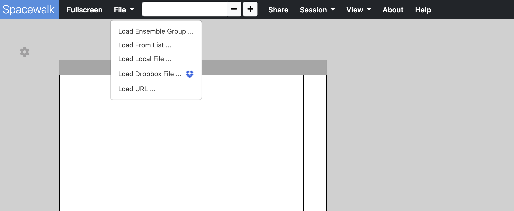
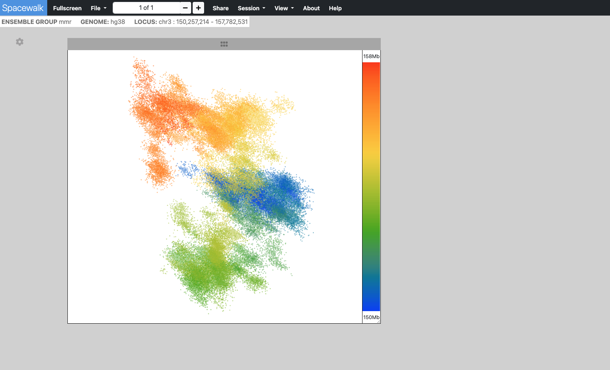
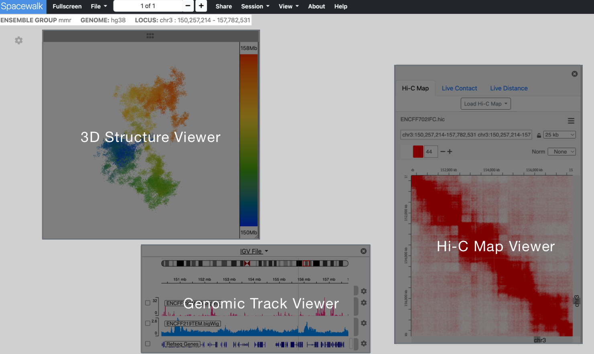

## Spacewalk Overview


Spacewalk provides interactive 3D visualization of super-resolution microscopy data, 
with integrated genomic analysis via the genomics browser [igv.js](https://github.com/igvteam/igv.js) 
and the Hi-C map viewer [juicebox.js](https://github.com/igvteam/juicebox.js)

## Getting Started

### Requirements
- Node >= v20.8.0
- NPM >= v10.1.0

### Supported Browsers

Spacewalk require a modern web browser with support for Javascript ECMAScript 2015.

### Installation
* Clone this repository.
````
git clone git@github.com:igvteam/spacewalk.git
````
* Install
````
npm install
````
### Build the app
````
npm run build
````
### Launch the app
````
npm run start
````
* Open a browser and enter the follow url to launch the app
````
localhost:8080/index.html
````

After launching the app, you will see a screen with a single empty 3D viewer. In the navbar use the **File** dropdown menu to load 3D structure into the 3D viewer.



Spacewalk supports the 3D visualization of
- Super-resolution microscopy (SRM) data
- Chromatin simulations
- Other forms of genome microscopy and spatial genomics

Spacewalk supports 3D visualization of data that comes in two general forms:
- Point Cloud - Typically derived from OlioSTORM data
- Ball & Stick - Typically derived from Chromatin simulations

#### Point Cloud
The point cloud is rendered as a collection of 3D point clusters, each corresponding to a specific genomic extent.
The color of each cluster is determined by the genomic navigator's color ramp bar, located on the right side of the 3D viewer.

When you mouse over the genomic navigator the corresponding 3D point cluster is highlighted.



#### Ball & Stick
Chromatin centroids are rendered as balls, each colored according to its genomic location.
Sticks (cylinders) connect the balls in the order they appear along the genomic range.
As the user moves the cursor along the genomic navigator on the right side of the 3D viewer,
the corresponding ball is highlighted based on its genomic location.

Alternatively, hovering over a ball will display its genomic location in the genomic navigator's
color ramp.


## Spacewalk in Detail



Spacewalk is organized around three visualization panels, each responsible for one aspect of genomic visualization:
#### 3D Structure Viewer
A 3D structure - SRM, simulation, etc. - is loaded by clicking on the **File** dropdown menu in the navbar

_Click the diagram for a larger view._

<a href="readme_img/sw-load-3d-file.png" target="_blank"></a>

#### Hi-C Map Viewer
An embedded instance [juicebox.js](https://github.com/igvteam/juicebox.js)
#### Genomic Track Viewer
An embedded instance of [igv.js](https://github.com/igvteam/igv.js)


- IGV. A fully functional IGV.js application. The app has been extended to enable interaction with the 3D model.
On the left, mousing across a track behaves similar to the genomic navigator. On the right we have selected a track. The
features are automatically mapped to the 3D model. Now mousing across the mapped track shows a sliding red ring on the 3D
model indicating genomic location.


- Juicebox. A fully functional Juicebox.js application. The app has been extended to enable interaction with the 3D model.
Mouse over the contact map to highlight the corresponding genomic locations on the 3D model.


- Distance Map. An ensemble level and trace level distance map created on the fly when an ensemble file is loaded.

- Contact Frequency Map. An ensemble level and trace level contact frequency map created on the fly when an ensemble file is loaded.

